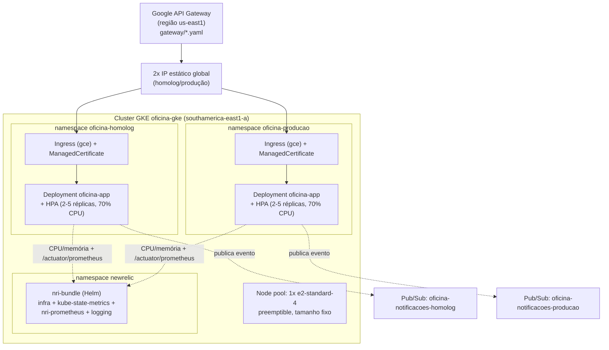

# oficina-infra-k8s

Infraestrutura do Cluster Kubernetes (Terraform) do Tech Challenge Fase 3
(Pós-Tech SOAT).

Um dos 4 repositórios exigidos pelo desafio, responsável por provisionar o
cluster Kubernetes gerenciado (GKE) que roda a aplicação principal
([`oficina`](https://github.com/robsonago/oficina)), a exposição pública
HTTPS + API Gateway, o tópico Pub/Sub de notificações, e o coletor de
observabilidade (New Relic) — com dois namespaces isolados
(`oficina-homolog`/`oficina-producao`) dentro do **mesmo** cluster, em vez de
dois clusters inteiros.

Dockerfile não se aplica a este repositório (Terraform não usa Docker).

## Índice

1. [Diagrama deste repositório](#1-diagrama-deste-repositório)
2. [O que este repositório provisiona](#2-o-que-este-repositório-provisiona)
3. [Stack](#3-stack)
4. [Pré-requisitos](#4-pré-requisitos)
5. [Como rodar](#5-como-rodar)
6. [CI/CD](#6-cicd)
7. [Observabilidade (New Relic)](#7-observabilidade-new-relic)
8. [Saídas relevantes](#8-saídas-relevantes)
9. [Ambiente ativo](#9-ambiente-ativo)

---

## 1. Diagrama deste repositório



Diagrama geral de todo o sistema (incluindo os outros 3 repositórios) em
[`oficina/docs/arquitetura/diagrama-componentes.md`](https://github.com/robsonago/oficina/blob/main/docs/arquitetura/diagrama-componentes.md).

## 2. O que este repositório provisiona

- Cluster GKE zonal `oficina-gke` (`southamerica-east1-a`), sem node pool
  default (gerenciado separadamente para permitir tuning de custo).
- Node pool próprio, tamanho fixo — **sem** autoscaling de nó: o
  `HorizontalPodAutoscaler` já escala em nível de Pod, ver
  [ADR-002](https://github.com/robsonago/oficina/blob/main/docs/adrs/002-horizontal-pod-autoscaler.md).
- Namespaces `oficina-homolog` e `oficina-producao`.
- Um `Secret` (`oficina-secret`) por namespace, com as credenciais do banco
  lidas do Secret Manager (criado em
  [`oficina-infra-db`](https://github.com/robsonago/oficina-infra-db)) —
  cada namespace aponta para o banco correspondente
  (`oficina_homolog`/`oficina_producao`).
- Um `ConfigMap` (`oficina-config`) por namespace com configuração não
  sensível da aplicação (inclui o nome do tópico Pub/Sub do próprio ambiente
  e o nome da aplicação no New Relic).
- Uma `ServiceAccount` do Kubernetes (`oficina-app`) por namespace, vinculada
  via Workload Identity à service account do GCP `oficina-app-cloudsql`
  (criada em `oficina-infra-db`), para autenticar no Cloud SQL sem chave de
  serviço em arquivo.
- Um tópico Pub/Sub por ambiente (`oficina-notificacoes-homolog`/`producao`),
  com a `ServiceAccount` da aplicação autorizada a publicar — consumido pela
  function `notification` do repositório
  [`oficina-auth-function`](https://github.com/robsonago/oficina-auth-function)
  (ver [ADR-001](https://github.com/robsonago/oficina/blob/main/docs/adrs/001-padrao-comunicacao-notificacoes.md)).

Os manifests da aplicação (`Service`/`ManagedCertificate`/`Ingress`/`Deployment`/`HPA`)
estão em [`manifests/homolog`](manifests/homolog) e
[`manifests/producao`](manifests/producao) — um conjunto por ambiente. O
`Service` é `ClusterIP`: o tráfego externo entra pelo `Ingress`. A imagem
`ghcr.io/robsonago/oficina-app` é pública, então não é preciso
`imagePullSecret`.

### Exposição pública HTTPS + API Gateway

Cada namespace tem um IP estático global reservado (Terraform,
`google_compute_global_address`), um `Ingress` (classe `gce`) e um
`ManagedCertificate` apontando para um hostname
[nip.io](https://nip.io) construído a partir desse IP (ex.:
`34.120.1.2.nip.io`) — assim a aplicação fica disponível via HTTPS público
com certificado confiável, sem precisar de domínio próprio. Isso é exigido
porque o backend do Google API Gateway só aceita endereços HTTPS.

**Atenção:** o IP estático (e portanto o hostname `nip.io`) é recriado do
zero a cada `terraform destroy` + `apply` — depois de recriar, é preciso
atualizar manualmente o IP hardcoded em `manifests/*/managed-certificate.yaml`
e em `gateway/*.yaml` (campo `x-google-backend.address`) antes de reaplicar o
Gateway.

Na frente disso, [`gateway/`](gateway) tem a especificação OpenAPI 2.0
(Swagger) usada para criar o Google API Gateway — uma API com um
`API Config`/`Gateway` por ambiente (`oficina-gateway-homolog` e
`oficina-gateway-producao`, região `us-east1`; API Gateway não está
disponível em `southamerica-east1`, ver
[RFC-001](https://github.com/robsonago/oficina/blob/main/docs/rfcs/001-escolha-da-nuvem.md)).
O gateway repassa o path original para o backend (`x-google-backend`), sem
nenhum bloco `security`/`securityDefinitions` no spec — a validação do JWT é
feita inteiramente pela aplicação (Spring Security). **Não é só uma escolha
de design**: declarar `security: [{bearerAuth: []}], type: apiKey` no Swagger
2.0 faz o Google API Gateway **consumir** o header `Authorization` como se
fosse autenticação própria dele, em vez de repassá-lo ao backend — quebrando
toda rota protegida (bug real encontrado nesta sessão, corrigido removendo o
bloco). O esquema atual de token (HMAC com chave compartilhada) também não é
compatível com a validação nativa de JWT do API Gateway, que exige um emissor
com chaves públicas (JWKS) — mais um motivo pra não delegar autenticação ao
Gateway. Quais rotas exigem token está documentado na tabela de endpoints do
README de [`oficina`](https://github.com/robsonago/oficina#11-endpoints-principais).

`gateway/oficina-gateway.template.yaml` é a referência com o placeholder
`__BACKEND_HOST__`; `gateway/homolog.yaml` e `gateway/producao.yaml` são
esse template com o host já substituído manualmente pelo IP de cada
ambiente (não há script de geração automática).

## 3. Stack

- Terraform >= 1.6
- Provider `hashicorp/google` ~> 6.0, `hashicorp/google-beta` (recursos do
  API Gateway só existem no provider beta) e `hashicorp/kubernetes` ~> 2.31
- GKE (cluster zonal, Workload Identity habilitado), node pool com 1 nó
  `e2-standard-4` preemptible
- Google API Gateway, Pub/Sub
- Helm (`nri-bundle`, instalado à parte do Terraform — ver [seção 7](#7-observabilidade-new-relic))
- State remoto em bucket GCS (`oficina-501820-tfstate`, prefixo `infra-k8s`)

## 4. Pré-requisitos

- `gcloud` autenticado (`gcloud auth application-default login`) e projeto
  configurado (`gcloud config set project oficina-501820`).
- APIs habilitadas: `container.googleapis.com`, `compute.googleapis.com`,
  `iam.googleapis.com`, `apigateway.googleapis.com`, `pubsub.googleapis.com`.
- Bucket de state já criado (`oficina-501820-tfstate`).
- `oficina-infra-db` já aplicado (os secrets `oficina-db-password`,
  `oficina-db-url-homolog` e `oficina-db-url-producao` precisam existir no
  Secret Manager antes do `apply` deste repositório).
- Helm instalado (`brew install helm`), só para a etapa de observabilidade.

## 5. Como rodar

```bash
terraform init
terraform plan -var-file=terraform.tfvars    # copie terraform.tfvars.example
terraform apply -var-file=terraform.tfvars
```

Depois do apply, configure o `kubectl` local:

```bash
gcloud container clusters get-credentials oficina-gke \
  --zone southamerica-east1-a --project oficina-501820
kubectl get ns
```

Aplique os manifests da aplicação (depois de atualizar os hostnames `nip.io`,
se o IP tiver mudado — ver seção 2):

```bash
kubectl apply -f manifests/homolog/
kubectl apply -f manifests/producao/
```

## 6. CI/CD

O workflow [`.github/workflows/terraform.yml`](.github/workflows/terraform.yml)
roda automaticamente:

- **Pull Request** (para `main` ou `homolog`): `terraform plan`, mostrando o
  que vai mudar antes de aprovar.
- **Push em `main`**: `terraform apply` automático — um único cluster
  compartilhado por homologação e produção (os dois namespaces), não há um
  apply separado por ambiente.

Autenticação via Workload Identity Federation (sem chave de service account
em segredo).

## 7. Observabilidade (New Relic)

O coletor roda dentro do próprio cluster (namespace `newrelic`), instalado
via Helm — **não** faz parte do `terraform apply` (chart de terceiros, mais
simples de gerenciar fora do state):

```bash
kubectl create namespace newrelic
gcloud secrets versions access latest --secret=newrelic-license-key > /tmp/nr-key
kubectl create secret generic newrelic-license-key -n newrelic --from-file=licenseKey=/tmp/nr-key
rm /tmp/nr-key

helm repo add newrelic https://helm-charts.newrelic.com && helm repo update
helm install nri-bundle newrelic/nri-bundle -n newrelic \
  --set global.customSecretName=newrelic-license-key \
  --set global.customSecretLicenseKey=licenseKey \
  --set global.cluster=oficina-gke \
  --set newrelic-infrastructure.enabled=true \
  --set newrelic-infrastructure.privileged=true \
  --set kube-state-metrics.enabled=true \
  --set nri-prometheus.enabled=true \
  --set newrelic-logging.enabled=true
```

Isso coleta CPU/memória dos pods e faz *scrape* de `/actuator/prometheus` da
aplicação (métricas de negócio customizadas). Os 3 dashboards, a condição de
alerta NRQL e os 2 Synthetic Monitors de uptime são configurados direto na
conta New Relic (via API/NerdGraph, não neste repositório) — detalhes em
[`oficina/docs/arquitetura/diagrama-componentes.md`](https://github.com/robsonago/oficina/blob/main/docs/arquitetura/diagrama-componentes.md).

Os Synthetic Monitors de uptime batem em `<host-nip.io>/actuator/health` —
como esse host muda a cada recriação do IP estático, o `uri` deles também
precisa ser atualizado manualmente depois (via NerdGraph), mesmo problema da
seção 2.

## 8. Saídas relevantes

- `get_credentials_command`: comando pronto para configurar o `kubectl`.
- `namespaces`: os dois namespaces criados.
- `homolog_hostname`/`producao_hostname`: hostnames nip.io usados pelo
  `ManagedCertificate` e pelo `x-google-backend` do gateway.
- `gateway_homolog_url`/`gateway_producao_url`: URL pública de cada
  ambiente — é por aqui que a API deve ser chamada (não diretamente pelo
  hostname nip.io).

## 9. Ambiente ativo

| Ambiente | Gateway (rotas de negócio) | Ingress direto (Swagger/health) |
|---|---|---|
| Homologação | `https://oficina-gateway-homolog-b0ob3sbi.ue.gateway.dev` | `https://136.68.30.187.nip.io` |
| Produção | `https://oficina-gateway-producao-b0ob3sbi.ue.gateway.dev` | `https://136.68.248.181.nip.io` |

Certificado gerenciado `Active` nos dois ambientes. **Atenção:** o IP (e portanto
o host `nip.io`) muda a cada recriação da infra — ver seção 2 — então esses
links ficam obsoletos depois do próximo `terraform destroy`+`apply`; confira
`terraform output homolog_ip producao_ip` para os valores atuais.
